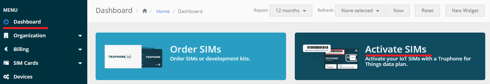

## Introduction
This QuickStart Guide will enable rapid evaluation of the Avnet IoTConnect platform using the C SDK on the Microchip AVR IoT Cellular Mini Kit.  This can also be used for other similar AVR Arduino boards.

For developing software leveraging the IoTConnect C SDK refer to the [Developer Guide](README.md).

## SIM Card Activation

* The AVR-IoT Cell Mini Kit contains a Truphone SIM. Follow the steps below to create an account and activate it.
  * Create an account or log in with an existing account at the [Truphone Sign-up page](https://account.truphone.com/register).
  * Activate the SIM from the account dashboard page by following the steps outlined in the activation process. 
    See the screenshot below for reference:



* Install the SIM into board by sliding the notched-corner end of the SIM in with the Truphone logo facing outwards.

## Cloud Account Setup
An IoTConnect account is required to continue this guide. If you need to create an account, a free 2-month subscription is available.  Please follow the [Creating a New IoTConnect Account](https://github.com/avnet-iotconnect/avnet-iotconnect.github.io/blob/main/documentation/iotconnect/subscription/subscription.md) guide and return to this guide once complete.
* The IoTConnect **CPID** and **Environment** values will be required when provisioning the board. These values can be located in the IoTConnect WebUI on the Key Vault page. Copy these values for future use.

## IoTConnect Firmware
***Note:** This process will require a USB A to USB C cable which is **not included** in the AVR-IoT Cell Mini kit.

* Download and extract the pre-compiled firmware ([avr-iot-071723.zip](https://saleshosted.z13.web.core.windows.net/sdk/arduino/avr-iot-071723.zip)).
* The package contains two files:
  * **avr-iot-provision.ino.hex:** Provisioning firmware. This will need to be loaded and run once to provision the board with the IoTConnect CPID and Environment information.
  * **avr-iot-sample.ino.hex:** Sample firmware. This is the actual sample code which should be loaded only after the board has been provisioned.
* Connect the board to your PC using a USB A to USB C cable.
* A new virtual drive will appear in your Windows Explorer.
* Follow the provisioning steps in the section below.

## Provisioning

* Install a serial console application, such as [Tera Term](https://ttssh2.osdn.jp/index.html.en).
* Open the serial console application and establish a connection to the board in order to see the provisioning output.
* Load the **Provisioning Firmware** (avr-iot-provision.ino.hex) onto the board by copying it into the root of the Virtual Drive that was created in the previous section.
* After the copy is complete, remove power from the board and reapply after 5 seconds.
* Once the board boots, verify there is output in the serial console that looks similar to the example below.

```
[INFO] Starting the provisioning sample...
[INFO] Ciphersuites config written successfully.
[INFO] HTTPS CA certificate updated successfuly.
[INFO] MQTT CA certificate updated successfuly.
-----BEGIN CERTIFICATE-----
MIIB8DCCAZegAwIBAgIQZqxXFSHF/eOiwnn/0rSQLzAKBggqhkjOPQQDAjBPMSEw
HwYDVQQKDBhNaWNyb2NoaXAgVGVjaG5vbG9neSBJbmMxKjAoBgNVBAMMIUNyeXB0
byBBdXRoZW50aWNhdGlvbiBTaWduZXIgMkQzMDAgFw0yMTAzMjUxMTAwMDBaGA8y
MDQ5MDMyNTExMDAwMFowQjEhMB8GA1UECgwYTWljcm9jaGlwIFRlY2hub2xvZ3kg
SW5jMR0wGwYDVQQDDBRzbjAxMjNFRTdBMTQzMjlEM0QwMTBZMBMGByqGSM49AgEG
CCqGSM49AwEHA0IA   [Sample Certificate]   /UeQWE93uvUa3Z3XHuoZis
naG+sYdmoGhgkfhwjYKH7eATjrSKeFPfX9c/vlOjYDBeMAwGA1UdEwEB/wQCMAAw
DgYDVR0PAQH/BAQDAgOIMB0GA1UdDgQWBBReZ3gqfZtIp+p4ZMn+FkIVTx5E6TAf
BgNVHSMEGDAWgBQss+/LXwRk0qR/1plYzq+aUB2NqTAKBggqhkjOPQQDAgNHADBE
AiByL9Qrcr9VC94fKPws5bIFd8a9YKFzp4ZPVuUJML863QIgFmCDPBO9zxRiJdLw
2qgjeuEeDVW6r0SVw4wpJSELhOY=
-----END CERTIFICATE-----
```
* Use the console to set the values for **CPID** and **ENV** which were obtained from the IoTConnect Web GUI in a previous step.
* The DUID value should be left unset. A DUID unique to your device will be generated and displayed on the console during startup.
* Obtain the fingerprint of the device certificate that is displayed on the screen.
This can be done with openssl command line or [this web site](https://www.samltool.com/fingerprint.php)
* Note the **fingerprint** and the **Device ID** value and use it in the next steps.

## Running Demo Code with Arduino IDE

* Load the Sample firmware image avr-iot-sample.ino.hex. 
* On a successful run, you should see an output similar to this:

```
[INFO] Starting the Sample Application 01.00.00
[INFO] CPID: [your CPID]
[INFO] Env : [your Env]
[INFO] DUID: avr-092ee282bb58cf55f34c66e3d3c
[INFO] Connecting to operator......... OK!
[INFO] +CCLK: "23/6/26,13:22:7-20"
[INFO] CPID: [your CPID]
[INFO] ENV:  [your Env]
[INFO] Attempting to connect to MQTT host:poc-iotconnect-iothub-030-eu2.azure-de
vices.net, client id:avtds-avr-092ee282bb58cf55f34c66e3d3c, username: poc-iotcon
nect-iothub-030-eu2.azure-devices.net/avtds-avr-092ee282bb58cf55f34c66e3d3c/?api
-version=2018-06-30
[INFO] IoTConnect Client Connected
[INFO] Sending: {"cpid":"****","dtg":"620c9902-17dd-46b0-a8a2-b20f77eed493","mt
":0,"sdk":{"l":"M_C","v":"2.0","e":"***"},"d":[{"id":"avr-092ee282bb58cf55f34c
66e3d3c","tg":"","d":[{"version":"01.00.00","cpu":3.1229999}],"dt":"2023-05-16T1
7:16:40.000Z"}],"t":"2023-05-16T17:16:40.000Z"}
```
