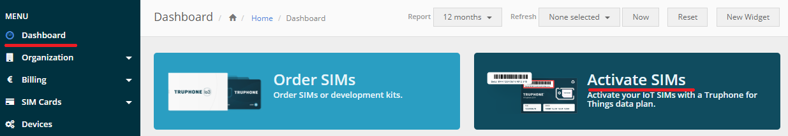

## Introduction
IoTConnect C SDK for Microchip AVR Arduino boards like AVR IoT Cellular Mini.

This guide is focusing on developing software with our IoTConnect C SDK.

If you are interested in evaluating and testing this board with IoTConnect,
then you may be interested in trying out our [Quickstart Guide](QUICKSTART.md)

## Setup Instructions

* Arduino IDE in Carriage Return input mode may suffice, but it is recommended to install a serial console application, 
such as [Tera Term](https://ttssh2.osdn.jp/index.html.en).

* Your board package should contain a Truphone SIM. Follow these steps to activate it:
  * Create an account or log in at the [Truphone Sign up page](https://account.truphone.com/register)
  * Activate your SIM from your account's dashboard page and following the steps outlined in the activation process. 
    See the screenshot below:



* Install the sim into the SIM slot on the board.

* Follow the
 [AVR-IoT Cellular Mini UserGuide's Development Environment Section](https://iot.microchip.com/docs/arduino/introduction/devenv) 
to set up and prepare your Arduino development environment.
The project has been tested with Arduino IDE 2.0.4, AVR-IoT-Cellular library version 1.3.8 and DXCore version 1.5.8.
It is recommended that you install these specific versions.
* Once your SIM is activated and Arduino environment set up, 
clone this repo into your Arduino sketch directory under the libraries directory.
For example, once you clone this SDK, the contents of this repo should be 
under C:\Users\<your username>\Documents\Arduino\libraries\iotconnect-mchp-avr-sdk* in Windows.
* **IMPORTANT:** After downloading or upgrading AVR-IoT-Cellular library, ensure to enable the following features
in atca_config.h located at C:\Users\<your username>\Documents\Arduino\libraries\AVR-IoT-Cellular\src\cryptoauthlib: 
```c
#define ATCAB_UPDATEEXTRA_EN              FEATURE_ENABLED
// ...
#define ATCAB_WRITE_EN                    FEATURE_ENABLED
```
and also increase the topic length from 128 to 384 in mqtt_lcient.h 
located at C:\Users\<your username>\Documents\Arduino\libraries\AVR-IoT-Cellular\src:
```c
#define MQTT_TOPIC_MAX_LENGTH 384
```

* Open the Arduino IDE and load the avr-iot-provision example by navigating
to File->Examples->iotconnect-mchp-avr-sdk->avr-iot-provision from the menu.
* Open the serial console application and establish a connection to the board in order to see the provisioning output.
* Run the avr-iot-provision.ino sketch by selecting the *Sketch->Upload Using Programmer* from the menu.
* You should see an output similar to this:

```
[INFO] Starting the provisioning sample...
[INFO] Setting up MQTT profile #1 and ciphersuites...
[INFO] MQTT profile and ciphersuite config written successfully.
[INFO] Setting up HTTP profile #3..
[INFO] HTTP profile was set up successfully.
[INFO] HTTPS CA certificate updated successfuly.
[INFO] MQTT CA certificate updated successfuly.
-----BEGIN CERTIFICATE-----
MIIB8DCCAZegAwIBAgIQZqxXFSHF/eOiwnn/0rSQLzAKBggqhkjOPQQDAjBPMSEw
HwYDVQQKDBhNaWNyb2NoaXAgVGVjaG5vbG9neSBJbmMxKjAoBgNVBAMMIUNyeXB0
byBBdXRoZW50aWNhdGlvbiBTaWduZXIgMkQzMDAgFw0yMTAzMjUxMTAwMDBaGA8y
MDQ5MDMyNTExMDAwMFowQjEhMB8GA1UECgwYTWljcm9jaGlwIFRlY2hub2xvZ3kg
SW5jMR0wGwYDVQQDDBRzbjAxMjNFRTdBMTQzMjlEM0QwMTBZMBMGByqGSM49AgEG
CCqGSM49AwEHA0IABNHmLcX7BUciDWCRoXyWM1UBd1/UeQWE93uvUa3Z3XHuoZis
naG+sYdmoGhgkfhwjYKH7eATjrSKeFPfX9c/vlOjYDBeMAwGA1UdEwEB/wQCMAAw
DgYDVR0PAQH/BAQDAgOIMB0GA1UdDgQWBBReZ3gqfZtIp+p4ZMn+FkIVTx5E6TAf
BgNVHSMEGDAWgBQss+/LXwRk0qR/1plYzq+aUB2NqTAKBggqhkjOPQQDAgNHADBE
AiByL9Qrcr9VC94fKPws5bIFd8a9YKFzp4ZPVuUJML863QIgFmCDPBO9zxRiJdLw
2qgjeuEeDVW6r0SVw4wpJSELhOY=
-----END CERTIFICATE-----
```
* Use the console at this point to provision your code with information found in your account:
  * CPID
  * Environment
* You may choose to enter a blank Device Unique ID (DUID), and in that case the default 
auto-generated ID, unique for each board will user. This ID will be printed on the screen.
* Obtain the fingerprint of the device certificate that is displayed on the screen above.
This can be done with openssl command line or [this web site](https://www.samltool.com/fingerprint.php)
* Note the **fingerprint** and the **Device ID** value and use it in the next steps.

## IoTConnect Setup

* Log into your IoTConnect account and create a new template using the IoTConnect Web user interface.
use the Self-Signed authentication type with a property with name "version" of type STRING and property with name
"random" and type NUMBER.
* Create a new device with name displayed on the provisioning sketch output above:
* Select your template created in the previous step.
* Paste your SHA1 or SHA256 fingerprint obtained in the previous steps as the *Primary Thumbprint* value. 
The pasted value should not contain colons. You may leave the *Secondary Thumbprint* value blank.

## Running Demo Code with Arduino IDE

* Open the Arduino IDE and load the avr-iot-sample example by navigating
to File->Examples->iotconnect-mchp-avr-sdk->avr-iot-sample from the menu.
* Run the sketch by selecting the *Sketch->Upload Using Programmer* from the menu.
* On a successful run, you should see an output similar to this:

```
[INFO] Starting the Sample Application 02.00.00
[INFO] CPID: [your CPID]
[INFO] Env : [your Env]
[INFO] DUID: avr-092ee282bb58cf55f34c66e3d3c
[INFO] Connecting to operator......... OK!
[INFO] +CCLK: "23/6/26,13:22:7-20"
[INFO] CPID: [your CPID]
[INFO] ENV:  [your Env]
[INFO] Attempting to connect to MQTT host:poc-iotconnect-iothub-030-eu2.azure-de
vices.net, client id:avtds-avr-092ee282bb58cf55f34c66e3d3c, username: poc-iotcon
nect-iothub-030-eu2.azure-devices.net/avtds-avr-092ee282bb58cf55f34c66e3d3c/?api
-version=2018-06-30
[INFO] IoTConnect Client Connected
[INFO] Sending: {"cpid":"****","dtg":"620c9902-17dd-46b0-a8a2-b20f77eed493","mt
":0,"sdk":{"l":"M_C","v":"2.0","e":"***"},"d":[{"id":"avr-092ee282bb58cf55f34c
66e3d3c","tg":"","d":[{"version":"01.00.00","cpu":3.1229999}],"dt":"2023-05-16T1
7:16:40.000Z"}],"t":"2023-05-16T17:16:40.000Z"}
```
